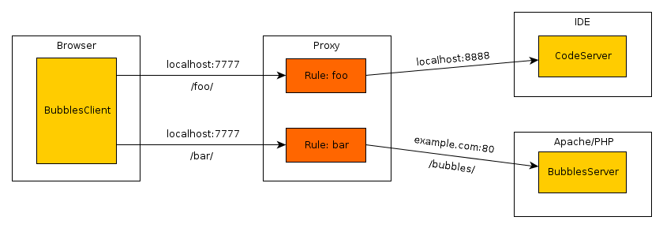

build
===== 

	mvn clean install

There is a dependency which cannot be downloaded automatically, it is the uibinding-smartgwt 1.0.4 library. It need to be installed manually on 
local development system: 

	mvn install:install-file -DgroupId=org.synthful -DartifactId=uibinding-smartgwt -Dversion=1.0.4 -Dpackaging=jar -Dfile=./lib/uibinding-smartgwt-1.0.4.jar

debug
=====

Google plugin for Eclipse is needed to debug.

	mvn gwt:debug

Start a remote debug session on port 8000 from your preferred IDE.

